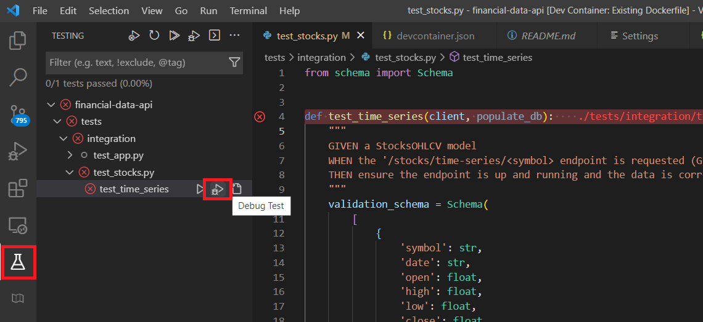

This document is a guide for setting up your work environment, you will find here the software I personally use on a day-to-day basis.

# VS Code

[installation link](https://code.visualstudio.com/download)

VS Code is an IDE where you can write and test code at the same time.

I personally prefer VS Code over PyCharm as it has better performance and VS Code has an extension for almost everything.
Also VSCode is entirely open-source whilst you would need PyCharm Professional(~$200/year) to debug your code in a Docker container for instance.

## Useful extensions

- [Python](https://marketplace.visualstudio.com/items?itemName=ms-python.python)
- [CodeMap](https://marketplace.visualstudio.com/items?itemName=oleg-shilo.codemap)
- [Docker](https://marketplace.visualstudio.com/items?itemName=ms-azuretools.vscode-docker)
- [Makefile tools](https://marketplace.visualstudio.com/items?itemName=ms-vscode.makefile-tools)
- [Remote - Containers](https://marketplace.visualstudio.com/items?itemName=ms-vscode-remote.remote-containers)
- [Remote - WSL](https://marketplace.visualstudio.com/items?itemName=ms-vscode-remote.remote-wsl)
- [markdownlint](https://marketplace.visualstudio.com/items?itemName=DavidAnson.vscode-markdownlint)
- [Markdown Preview Mermaid Support](https://marketplace.visualstudio.com/items?itemName=bierner.markdown-mermaid)
- [Pytest IntelliSense](https://marketplace.visualstudio.com/items?itemName=Cameron.vscode-pytest)
- [YAML](https://marketplace.visualstudio.com/items?itemName=redhat.vscode-yaml)

## How to debug your python code


Then select Python > Module and enter your test name (generally the name of the function you want to test) or module name if you want to run an entire file.

This step creates a `launch.json` file under the `.vscode` directory in your current folder.

### Running your code on your host machine

#### Using launch.json

```json
{
    "version": "0.2.0",
    "configurations": [
        {
            "name": "test_hello_world",
            "type": "python",
            "request": "launch",
            "module": "unittest",
            "args": ["path_to_your_module.class_name.test_name"],
            "python": "/path/to/your/python/interpreter",
            "justMyCode": false, // Debug only user-written code
            "env": {"ENVIRONMENT_VARIABLE": ""}
        }
    ]
}
```

#### Using Pytest extension

Alternatively you could use the [Pytest IntelliSense extension](https://marketplace.visualstudio.com/items?itemName=Cameron.vscode-pytest) that gives you a much more user friendly interface.



When running the remote container as root user, pytest might crash because the default python interpreter has changed. In this case you may have to specify the python interpreter path in `.vscode/settings.json` such as:

```json
{
    "python.testing.pytestArgs": [
        "tests"
    ],
    "python.testing.pytestEnabled": true,
    "python.defaultInterpreterPath": "/path/to/your/python/interpreter"
}
```

### Debugging inside a Docker container

First you will need to install the [Remote - Containers](https://marketplace.visualstudio.com/items?itemName=ms-vscode-remote.remote-containers) extension. Then click on the double arrows at the bottom left of the window.


and select `Reopen in Container`. This step will generate a `devcontainer.json` file in a `.devcontainer` directory.

You might as well set the following key/value pair in the `.devcontainer.json` to resolve permission issues.

```json
"remoteUser": "root"
```

By default the extensions you install in a remote container will be lost after you rebuild it. To avoid having to reinstall everything you can specify your extensions in `.devcontainer`

```json
"customizations": {
    "vscode": {
        "extensions": [
            "Cameron.vscode-pytest",
            "ms-python.python",
            "oleg-shilo.codemap"
        ]
    }
}
```

That task is done using the `Add to devcontainer.json` option.


# Creating a Python virtual environment

```bash
$ python -m venv venv  # This command creates a new environment

$ . ./venv/bin/activate  # To use the python virtual env
```

> Pro tip: Don't forget to upgrade pip in your virtual environment with `pip install -U pip`

# Docker

[Installation link](https://docs.docker.com/desktop/windows/install/)

Whether you deploy to containers or not, containers make a great development environment because you can:

Develop with a consistent, easily reproducible toolchain on the same operating system you deploy to.
Quickly swap between different, separate development environments and safely make updates without worrying about impacting your local machine.
Make it easy for new team members / contributors to get up and running in a consistent development environment.
Try out new technologies or clone a copy of a code base without impacting your local setup.

## Docker Compose

[Docker Compose CLI plugin](https://docs.docker.com/compose/install/compose-plugin/)

*"Compose is a tool for defining and running multi-container Docker applications. With Compose, you use a YAML file to configure your application’s services. Then, with a single command, you create and start all the services from your configuration."
(https://docs.docker.com/compose/)*

# WSL2(Windows Subsystem for Linux)

Windows Subsystem for Linux is a compatibility layer for running Linux binary executables natively on Windows.

[Installation link](https://docs.microsoft.com/en-us/windows/wsl/install)

You will also need to install Ubuntu(or any other Linux distributions) from the Microsoft app store in order to access the Linux terminal on Windows.

# Oh My Zsh

Oh My Zsh is a delightful, open source, community-driven framework for managing your Zsh configuration. It comes bundled with thousands of helpful functions, helpers, plugins, themes.

To install oh-my-zsh you will need to install ZSH first:

```bash
sudo apt update && sudo apt install zsh 
```
[Oh My ZSH installation link](https://ohmyz.sh/#install)

# Configure your Git and GitHub SSH Keys

https://www.freecodecamp.org/news/git-ssh-how-to/

# Run CICD locally

- Run Github Actions with [act](https://github.com/nektos/act)
- Run Gitlab CICD with [GitLab Runner](https://docs.gitlab.com/runner/install/)

# postgresql on wsl2 for windows

https://www.cybertec-postgresql.com/en/postgresql-on-wsl2-for-windows-install-and-setup/

> Pro tip: Also consider storing your passwords in ~/.pgpass

# UML diagrams with Mermaid

Mermaid is a JavaScript based diagramming and charting tool that renders Markdown-inspired text definitions to create and modify diagrams dynamically. I find it very useful for explaining convoluted workflows to colleagues.

[Official documentation](https://mermaid-js.github.io/mermaid/#/)

An example of sequence diagram:


